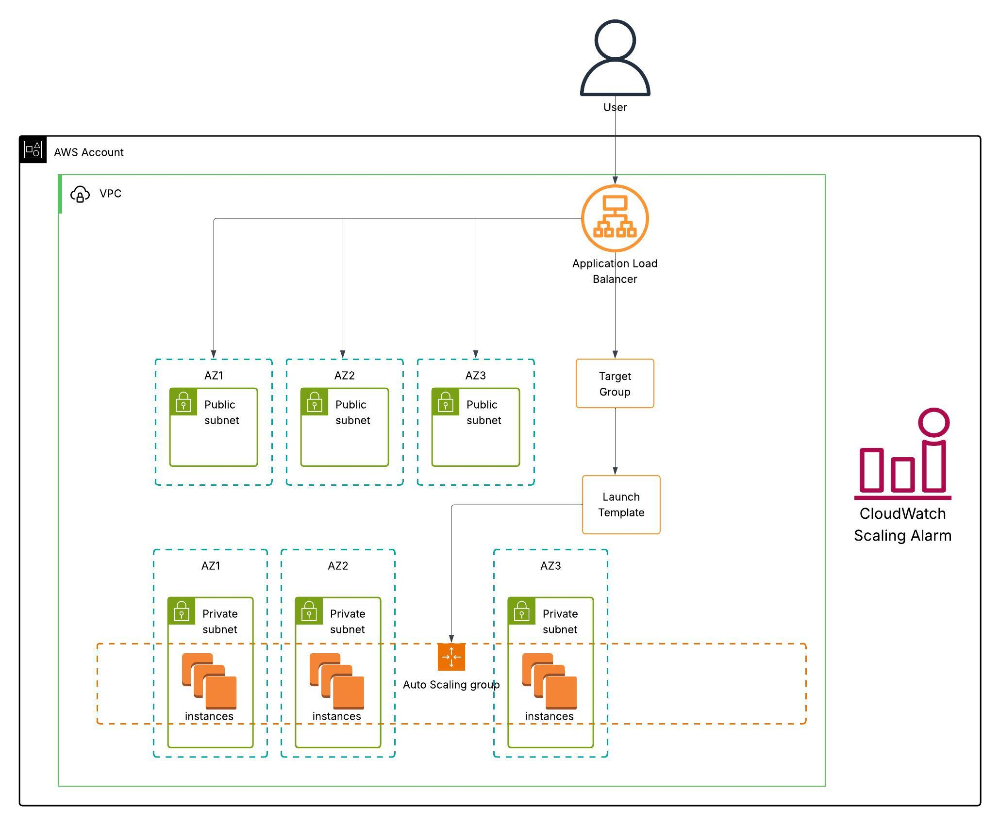

# 🏗️ Autoscaling Apache Web Server Using Terraform on AWS 

This project provisions a **highly available Apache web server infrastructure** using Terraform on AWS. The architecture uses an Application Load Balancer (ALB), Auto Scaling Group (ASG), and spans **three Availability Zones (AZs)** with public and private subnets to ensure fault tolerance, scalability, and performance.

---

## 📌 Project Objectives

- Deploy a custom **VPC** with 3 public and 3 private subnets across 3 Availability zones (AZs)
- Provision an **Application Load Balancer (ALB)** with Target Group and health checks
- Use a **Launch Template** to define EC2 Apache web server configurations
- Configure an **Auto Scaling Group (ASG)** across 3 AZs with dynamic scaling policies
- Automatically install and run Apache HTTP server using a **user data script**
- Set up **CloudWatch alarms** to monitor CPU usage and trigger scaling
- Test scaling policy with **set-alarm-state** in PowerShell

---

## 📐 Architecture Overview

<p align="center">
  
</p>

---

## 📁 File Structure

| File | Description |
|------|-------------|
| `provider.tf` | AWS provider configuration |
| `vpc.tf` | VPC, subnets, route tables, internet gateway, and NAT gateway |
| `variables.tf` | Input variables for customization |
| `output.tf` | Terraform outputs (e.g., ALB DNS) |
| `alb.tf` | Load Balancer, listeners, and target groups |
| `launch_templates.tf` | EC2 Launch Template with Apache install script |
| `asg.tf` | Auto Scaling Group and scaling policies |
| `install_apache.sh` | User data script to install Apache on EC2 |
| `terraform.tfstate` | Terraform state file (not recommended to upload) |
| `terraform.tfstate.backup` | State backup (for recovery) |

---

## 🚀 How to Deploy

> **Prerequisite:** AWS CLI configured and Terraform installed

```bash
# 1. Clone the repo
git clone https://github.com/s-oa18/Terraform-Autoscaling-Webserver.git
cd Terraform-Autoscaling-Webserver

# 2. Initialize Terraform
terraform init

# 3. Review the plan
terraform plan

# 4. Apply to deploy infrastructure
terraform apply
```

---

### 🖥️ Accessing the Web Server

After deployment, Terraform will output the DNS name of the ALB:
```bash
Outputs:

alb_dns_name = "apache-alb-1987387423.eu-west-1.elb.amazonaws.com"
```
Open this in a browser to see the Apache welcome page served from EC2 instances.

---

### 🔧 Apache Install Script (User Data)

The script install_apache.sh is injected into the EC2 instances using the launch template and performs:

- Apache installation
- Starting the web server
- Enabling the service to persist on reboot

---

### 📊 CloudWatch Alarms (Auto Scaling Trigger)

CloudWatch alarms are configured to monitor average CPU utilization of the EC2 instances in the ASG.

Dynamic Scaling Policy (simple scaling)
Scale out when CPU > 70%
Scale in when CPU < 10%

---

### 🧪 Test Autoscaling Alarms in PowerShell

You can simulate the alarm state manually without stressing the EC2 instance. This is useful to test how your Auto Scaling Group (ASG) responds to alarm triggers.

⚠️ This does not trigger actual scaling but is useful for testing alert integrations or visual verification in the AWS Console.

```bash
aws cloudwatch set-alarm-state \
  --alarm-name "apache_cpu_alarm_up" \
  --state-value ALARM \
  --state-reason "Testing purposes"
```

***To revert***
```bash
aws cloudwatch set-alarm-state \
  --alarm-name "apache_cpu_alarm_up" \
  --state-value OK \
  --state-reason "Reset after testing"
```

---

### 🔄 Auto Scaling

- CloudWatch alarms automatically adjust the number of EC2 instances based on CPU load
- Instances are spread across 3 Availability Zones

---

### 🧹 Teardown

```bash
terraform destroy
```
Dont forget to run "Terraform Destroy" to delete all provisioned resources. Failure to do this will rack up cost!
